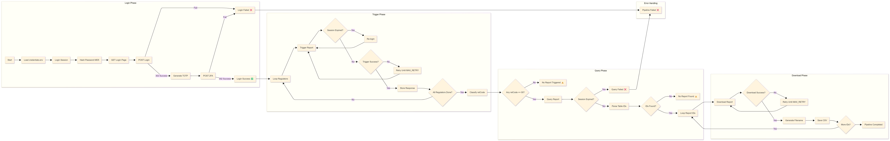

# 🔎 CPS Report Automation Pipeline

## 1️⃣ Overview

本專案為一套自動化報表處理流程，負責從後台系統登入、觸發報表、查詢報表狀態，並最終下載 CSV 報表資料。

整體流程涵蓋：
* 🔐 自動登入（含 2FA 驗證）
* 🚀 報表觸發（Trigger）
* 🔍 報表查詢（Query）
* 📥 報表下載（Download）
* ♻️ Session (過期自動重試機制)
* 🧾 結構化 Logging（可追蹤 pipeline 每一步）


## 2️⃣ Why

在實務場景中，報表系統通常具備以下問題：

* 需要人工登入 + 操作（低效率）
* 有 2FA（難以自動化）
* 報表生成為非同步（需輪詢）
* Session 容易過期（流程不穩定）
* 網站流程可能因延遲或異常導致中斷，因此設計重試機制以降低失敗風險


## 3️⃣ How

### 🔐 Login Flow

```text
1. 密碼 MD5 Hash
2. 取得登入頁面（建立 session）
3. 提交帳密登入
4. 產生 TOTP（2FA）
5. 提交 2FA 驗證
6. 回傳 authenticated session
```

#### 核心特點：

* 使用 `requests.Session()` 維持登入狀態
* 整合 `pyotp` 自動產生 2FA
* 支援錯誤 logging + exception handling

### 🚨 Pipeline Flow

```text
[ Login ]
   ↓
[ Trigger Report ]
   ↓
[ Query Report ]
   ↓
[ Parse Report IDs ]
   ↓
[ Download Reports ]
   ↓
[ Save CSV ]
```


## 4️⃣ Main Flow

### ① Trigger Report（報表觸發）

* 依據 `regulator_map` 逐一觸發報表
* 若 session 過期 → 自動重新登入
* 支援 retry 機制（MAX_RETRY）

---

### ② Query Report（查詢報表）

* 依時間區間查詢報表
* 解析 HTML table（透過 `BeautifulSoup`）
* 抽取 report IDs

---

### ③ Download Report（下載報表）

* 根據 report ID 下載資料
* 自動解析欄位（如商戶名稱）
* 產生標準化檔名：

```bash
CPS_{ReportType}_{Regulator}_{Timestamp}.csv
```


## 5️⃣ Use Method

### ① 安裝套件（requirements.txt）

請先建立 `requirements.txt`：

```txt
requests
pyotp
beautifulsoup4
pandas
```

or 安裝方式：

```bash
pip install -r requirements.txt
```

### ② 設定 credentials.env

```env
cps_account=your_account
cps_password=your_password
cps_secret_key=your_2fa_secret
```

### ③ 可調節 main.py 參數

以下為主要可調整設定區（位於 `main.py` 上方）：

```python
# 🔁 重試次數
# 建議5~10 次，若網路不穩可提高穩定度
MAX_RETRY = 10


# 🔁 查詢區間範圍
# 控制單次報表查詢資料量，避免 timeout 與效能瓶頸
# 預設 5 分鐘；大量資料可調整至 15 分鐘以上（建議分批處理）
QUERY_RANGE_MINUTES = 5


# 🧩 服務名稱（通常不需修改）
service = 'CpsMonitor'


# 📊 報表類型
# - 入金 → 'HistoryOrder'
# - 出金 → 'AnpayOrder'
# - 限制：一次查詢單一 report_type，若多種需分批呼叫
report_types = [
               'HistoryOrder',
               'AnpayOrder'
               ]


# 🌍 監管機構設定
# 結構 : {ID: 名稱}
# - ID   ：平台提供（不可修改）
# - 名稱 ：自訂（可用於檔案命名）
# 用法： 功能
# - 新增 → '新ID': '名稱'
# - 停用 → 加 # 註解
regulator_map = {
    '630045110000010': 'ASIC',
    '630045110000074': 'FCA',
    '630045110000054': 'VFSC1',
    '630045110000029': 'VFSC2'
}


# ⏱️ 查詢時間區間
# 格式：'YYYY-MM-DD'
# 建議區間不要過大（避免 timeout / 資料過多）
# 💡 範例：撈取2026年03月20日~23日 → '2026-03-20','2026-03-23'
start_date ,end_date = '2026-03-20','2026-03-23'


# 🔐 憑證（通常不需修改）
credentials = load_env_file("./credentials.env")
```


### ④  執行程式

```bash
python main.py
```


### ⑤ 輸出結果

下載檔案會自動產生：

```bash
CPS_{ReportType}_{Regulator}_{Timestamp}.csv
```

範例：

```bash
CPS_Deposit_ASIC_20260320100530.csv
```


## 6️⃣ Boundary / Limitations

本專案雖具擴充性，但在使用上仍有以下限制與注意事項：

### 🔹 1. 查詢時間區間限制(Query_TimeRange_Limitations)

* 單次查詢區間不宜過長
* 過大可能造成：

  * API timeout
  * 回傳資料過多，影響效能

**建議範例：**

* 測試：5～10 分鐘區間
* 正式：分段查詢（例如每小時一批）

```python
start_time_str, end_time_str = '2026-03-20 08:55:00', '2026-03-20 09:05:00'
```

* 💡若目前時間09:00，預先查詢08:55 ~ 09:05（抓前後buffer前置量避免漏資料）


### 🔹 2. 商務號限制 (Regulator_Map)

* ID 必須為平台提供之有效帳號
* 錯誤 ID 將導致查詢失敗或無資料
* 不建議一次設定過多帳號（可能影響效能）

**範例結構：**

```python
regulator_map = {
    '630045110000010': 'ASIC',
    '630045110000074': 'FCA',
    '630045110000054': 'VFSC1',
    '630045110000029': 'VFSC2'
}
```


### 🔹 3. 重試次數限制 (Max_Retry_Times)

* 過高會增加執行時間
* 若持續失敗，需確認 API 或網路狀態

```python
MAX_RETRY = 5
```


## 7️⃣ Logging Design

每個階段都有：
* `stage`（流程階段）
* `event`（start / end）
* `status`（ok / error / retry）

👉 可直接串接：
* ELK Stack
* Datadog
* Cloud Logging


## 8️⃣ Flow Chart
<p align="center">
  
</p>


**Author :** Peter Chang  
**Date :** 2026-03-20  
**Version :** 1.0.0


<!--  -->