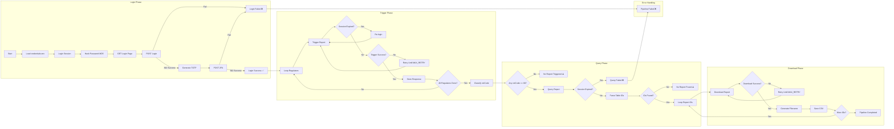

```mermaid
flowchart LR

    %% ===== Login Phase =====
    subgraph LOGIN[Login Phase]
        A[Start] --> B[Load credentials.env]
        B --> C[Login Session]

        C --> C1[Hash Password MD5]
        C1 --> C2[GET Login Page]
        C2 --> C3[POST Login]

        C3 -->|302 Success| C4[Generate TOTP]
        C3 -->|Fail| C_ERR[Login Failed ❌]

        C4 --> C5[POST 2FA]
        C5 -->|302 Success| D[Login Success ✅]
        C5 -->|Fail| C_ERR
    end

    %% ===== Trigger Phase =====
    subgraph TRIGGER[Trigger Phase]
        D --> E[Loop Regulators]

        E --> F[Trigger Report]
        F --> G{Session Expired?}

        G -->|Yes| H[Re-login]
        H --> F

        G -->|No| I{Trigger Success?}
        I -->|No| F_RETRY[Retry Until MAX_RETRY]
        F_RETRY --> F

        I -->|Yes| J[Store Response]

        J --> K{All Regulators Done?}
        K -->|No| E
        K -->|Yes| L[Classify retCode]
    end

    %% ===== Query Phase =====
    subgraph QUERY[Query Phase]
        L --> M{Any retCode == 00?}

        M -->|No| END1[No Report Triggered ⚠️]
        M -->|Yes| N[Query Report]

        N --> O{Session Expired?}
        O -->|Yes| Q_ERR[Query Failed ❌]
        O -->|No| P[Parse Table IDs]

        P --> R{IDs Found?}
        R -->|No| END2[No Report Found ⚠️]
        R -->|Yes| S[Loop Report IDs]
    end

    %% ===== Download Phase =====
    subgraph DOWNLOAD[Download Phase]
        S --> T[Download Report]
        T --> U{Download Success?}

        U -->|No| V[Retry Until MAX_RETRY]
        V --> T

        U -->|Yes| W[Generate Filename]
        W --> X[Save CSV]

        X --> Y{More IDs?}
        Y -->|Yes| S
        Y --> END3[Pipeline Completed ]
    end

    %% ===== Error Handling =====
    subgraph ERROR[Error Handling]
        C_ERR --> END_ERR[Pipeline Failed ❌]
        Q_ERR --> END_ERR
    end
```

# 批次匯出 (Batch Size)
(O) 
    1. 可以有效確定只要拿特定時間報表就好(顆粒感小)
    2. Excel一定可以開起來分析
(X) 
    1. 檔案較多，會需要查找

# 一次匯出 (SameTime Size)
(O) 可以大幅縮小檔案量，把他全部合併再一起(顆粒感大)
(X) 
    1. 記憶體耗費大
    2. 數據量大Excel會開不起來

